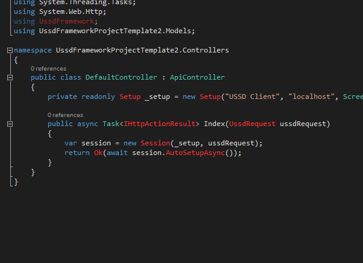
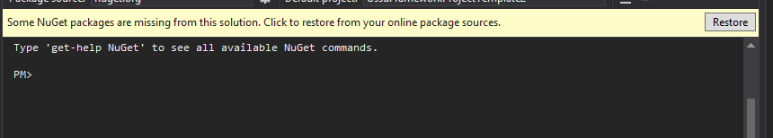
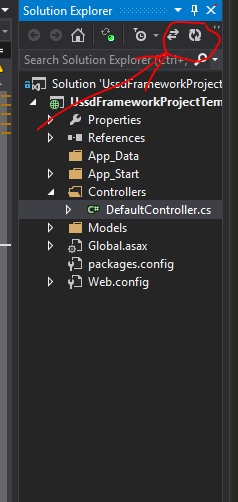

# USSD Framework Project Template

This is a Visual Studio project template for [SMSGH USSD Framework](http://github.com/smsgh/ussd-framework). Tested on Visual Studio 2013.

Download installer [here](https://github.com/smsgh/ussd-framework-project-template/releases/download/v1.0.0/UssdFrameworkTemplateInstaller.vsix).

__Note:__ If you are unable to download the file using Google Chrome try another browser.

## Fix Dependencies

Upon starting a project you will notice some NuGet dependencies are missing.

Open Package Manager Console and click __Restore__ to download missing dependencies.

Refresh Solutions Explorer for updates to reflect.

